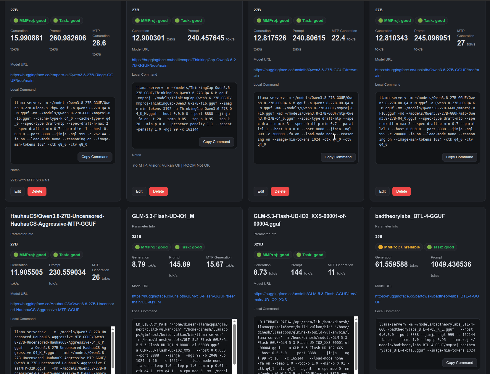

# AMD Dash — Local LLM Benchmark Notebook



A tiny, local-only web app for tracking local LLM testing results over time.
Save, edit, delete, and search benchmarks, then compare previous tests.

**Self host?:** yes.

**Benchmark data:** `~/amddash/data.yaml` (the only persistent store). **Sample data** [data/data.yaml](data/data.yaml) Tested on AMD Ryzen AI Max+ 395 128 GB Strix Halo Framework Desktop

## What it tracks

Each benchmark stores:

- `id` — stable, auto-generated identifier
- `name` — model name
- `model_url` — optional, clickable link
- `local_command` — the full command, kept exactly as typed (never executed)
- `mmproj_accuracy` — `good`, `unreliable`, `bad`, or `untested`
- `task_accuracy` — `good`, `unreliable`, `bad`, or `untested` (task/vision quality, tracked separately from MMProj)
- `prompt_speed` — prompt processing speed (tok/s)
- `generation_speed` — generation speed (tok/s)
- `notes` — optional notes

## Features

- Add / edit / delete / search benchmarks
- Copy Command button (clipboard), with a "Copied!" confirmation
- MMProj and Task status indicators: 🟢 Good, 🟡 Unreliable, 🔴 Bad, ⚪ Untested
- Prominent generation-speed numbers
- Automatic ranking + **instant reranking** (no page reload)
- Friendly errors instead of stack traces

## Requirements

- Python 3.9+
- Flask
- PyYAML

## Installation

```bash
python3 -m venv .venv
.venv/bin/pip install -r requirements.txt
```

(Or simply `pip install -r requirements.txt` if you already have a Python env.)

## Running the application

```bash
./run.sh
```

Or use the included Makefile:

```bash
make install   # create .venv + install requirements.txt
make run       # run locally on port 5000
make stop      # stop the local app
```

Then open http://127.0.0.1:5000 in your browser.

Optional environment variables (none are required):

- `AMDASH_HOST` — bind address, default `127.0.0.1`
- `AMDASH_PORT` — port, default `5000`
- `AMDASH_DATA_FILE` — data file path, default `~/amddash/data.yaml`
  (used by the Docker image to point at the mounted data file)

The app binds to `127.0.0.1` by default and is never exposed publicly unless
you change `AMDASH_HOST` yourself.

## Running with Docker

A `Dockerfile` and `docker-compose.yml` are included.

```bash
docker compose up -d --build
```

Or via the Makefile:

```bash
make build   # docker build -t amd-dash .
make up      # docker compose up -d --build
make down    # docker compose down
```

Then open http://127.0.0.1:5000.

The compose file bind-mounts the host directory `~/amddash/` into the
container at `/data/amddash/`. The app reads/writes `/data/amddash/data.yaml`,
which is the same file as the host's `~/amddash/data.yaml`, so benchmark data
survives container restarts and stays editable on the host.

Two things matter for Docker:

- **Mount the whole directory, not the single file.** The app saves data with
  atomic writes (temp file + rename). A rename over a file mount point fails
  with `EBUSY`, so only a directory mount works.
- **Run as your host UID/GID.** Compose sets `user: ${UID:-1000}:${GID:-1000}`
  so files written into the mount stay owned by your host user instead of
  root. The image also runs as a non-root user by default.

If your host user's UID is not 1000, export `UID`/`GID` before `docker compose up`:

```bash
export UID=$(id -u) GID=$(id -g)
docker compose up -d --build
```

To stop: `docker compose down` (data is kept on the host).

## Data location

All benchmark data lives in `~/amddash/data.yaml`. On first run the app
automatically creates `~/amddash/` and `data.yaml` if they are missing. Writes
are atomic (temp file + replace), so a failed write never destroys existing
data. If the data file is invalid YAML, the app shows an error and does **not**
overwrite it.

## YAML format

```yaml
- id: qwen-example
  name: Qwen Example
  model_url: https://example.com/model
  local_command: LD_LIBRARY_PATH="/home/user/..." llama-server -m /home/user/model.gguf -ngl 999
  mmproj_accuracy: good
  task_accuracy: good
  prompt_speed: 458
  generation_speed: 28.9
  notes: Fast and reliable vision performance.
```

YAML is serialized ASCII-safe via PyYAML. Non-ASCII characters the user enters
are escaped so the file stays ASCII-compatible. `local_command` is preserved
exactly as entered.

## How ranking works

Entries are ranked automatically, best first:

1. **MMProj accuracy** descending: `good` → `unreliable` → `bad` → `untested`
2. **Generation speed** descending (within the same accuracy group)
3. **Prompt speed** descending (breaks ties)

New or edited entries immediately jump to their correct position — no page
refresh needed. Search keeps the same ranking rules.

## Add / edit / delete

- **+ Add Benchmark** opens the form.
- **Edit** reopens the same form pre-filled; saving updates the data file and
  moves the entry to its correct rank instantly.
- **Delete** asks for confirmation first.

## Changing the UI

The UI is plain HTML/CSS/vanilla JavaScript:

- `templates/index.html` — page structure
- `static/style.css` — styling
- `static/app.js` — frontend logic (ranking, search, copy, modals)

The backend is a single file, `app.py`. No build system, no frameworks.

## Security note

`local_command` values are **never executed**. They exist only for reference
and copy/paste. The only command action is **Copy Command**.

The app is fully offline: no telemetry, no analytics, no cloud services, no
authentication, and no external databases.

## License

AMD Dash is released under the **MIT License** (see `LICENSE`).
Copyright (c) 2026 Dinesh Ravi.
